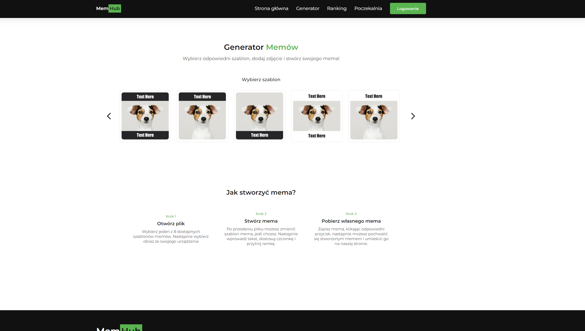

# Memwebsite

Memwebsite is a full-featured web application designed for creating, sharing, and moderating memes. The application allows users to sign up, log in, submit memes, comment on memes, and report inappropriate content. Admins have the ability to manage user content and handle reports.

## Table of Contents

- [Features](#features)
- [Technologies Used](#technologies-used)
- [Usage](#usage)
- [Appearance of the application ](#views)

## Features

- **User Registration and Login**: Users can create an account, log in, and manage their profile.
- **Meme Submission**: Users can upload memes and add descriptions.
- **Commenting**: Users can comment on memes.
- **Reporting**: Users can report inappropriate memes and comments.
- **Admin Dashboard**: Admins can view, approve, or delete memes and comments, and handle user reports.
- **Ranking System**: Display rankings of users based on their activity and popularity of their memes.
- **Contact Form**: Users can contact the site administrators through a contact form.
- **Password Recovery**: Users can recover their passwords via email.

## Technologies Used

- **Frontend**:

  - HTML5
  - CSS3
  - JavaScript
  - Bootstrap

- **Backend**:

  - PHP
  - MySQL (for database management)

- **Tools and Libraries**:
  - Composer (for PHP dependency management)
  - Gulp (for task automation)
  - JSDoc (for JavaScript documentation)
  - Doxygen (for generating documentation from annotated C++ sources)
  - Node.js (for JavaScript runtime environment)
  - Various PHP packages (specified in `composer.json`)

## Appearance of the application

### Generate mem section

 - [Adding](<readmeDoc/Testy - Dodawanie mema.pdf>) - [Login](<readmeDoc/Testy - Logowanie.pdf>) - [User account](<readmeDoc/Testy - Profil Użytkownika.pdf>)
